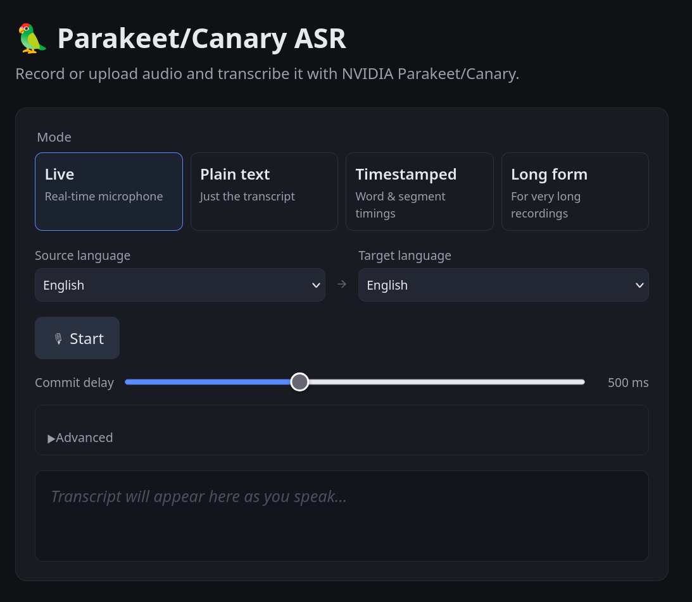

# Nemotron ASR Server

A FastAPI service that serves NVIDIA's **Nemotron** cache-aware streaming
speech-to-text model (`nvidia/nemotron-3.5-asr-streaming-0.6b`), plus a Svelte
frontend for recording, uploading, and live-transcribing audio in the browser.
Designed to run on a node with NVIDIA GPUs.



```
.
├── server/      # FastAPI + NeMo API (managed with uv)
├── frontend/    # Svelte + TypeScript app (managed with Deno)
└── docker-compose.yml
```

> **Model requirement**: the streaming Nemotron model needs a recent NeMo
> runtime (NeMo 26.06 / `main`). If the pinned `nemo-toolkit` in
> `server/pyproject.toml` is older than the release that ships this model,
> install NeMo from source (`pip install
> "nemo_toolkit[asr] @ git+https://github.com/NVIDIA/NeMo.git@main"`).

## Features

- **Native cache-aware streaming** — the model streams natively: audio is fed
  chunk by chunk through the encoder while the encoder cache and the running
  RNN-T hypothesis are carried forward between steps. No re-transcription or
  stability heuristics — emitted tokens are not revised.
- **Selectable latency** — the streaming look-ahead (`ATT_CONTEXT_SIZE`) trades
  latency for accuracy: `[56,0]` ≈ 80 ms up to `[56,13]` ≈ 1.12 s.
- **Offline modes** — plain text, word/segment/char timestamps, and a long-form
  endpoint (the streaming encoder handles arbitrarily long audio).
- **Live transcription** — real-time streaming over WebSocket, driven by
  client-side Silero VAD so only detected speech reaches the server.
- **Any audio in** — uploads are decoded, downmixed to mono, and resampled to
  16 kHz client-side before upload (WAV, WebM/Opus, and most browser formats).
- **Parallel requests** — one model replica is loaded per GPU; offline requests
  check out an idle replica, and each live session holds one replica for its
  duration, so concurrent streaming sessions are capped at the pool size.
- **Multilingual** — the model transcribes ~40 locales. Pass `target_lang` as a
  BCP-47 locale (e.g. `de-DE`) or `auto` to detect the language automatically.

## UI overview

The frontend is a single card with four mode tabs:

| Tab | Description |
| --- | ----------- |
| **Live** | Real-time mic transcription with Silero VAD activity meter |
| **Plain text** | Record or upload → plain transcript |
| **Timestamped** | Record or upload → transcript + word/segment timings |
| **Long form** | Record or upload → long-form transcript |

A single language selector (Auto-detect plus the supported locales) appears at
the top; it is disabled while live transcription is active.

### Live transcription

The Live tab uses the [Silero VAD](https://github.com/ricky0123/vad) browser
library (ONNX Runtime Web, v5 model) to detect voice activity locally:

1. Click **Start** — the ONNX model is loaded (one-time, ~2 s) and a WebSocket
   connection is opened to `/v1/transcribe/stream`.
2. The VAD runs on every audio frame (512 samples / 32 ms) and shows a
   **probability meter** that fills green→red as speech likelihood rises. A
   pulsing dot indicates active speech.
3. Only frames where speech is detected are forwarded to the server as
   PCM-16 / 16 kHz binary WebSocket frames; silent intervals are dropped.
4. The server streams back `partial` events carrying the running transcript of
   the current utterance (shown in italic grey), updated in real time as the
   model emits tokens.
5. When the VAD detects that the user has stopped speaking it waits for the
   **commit delay** (configurable slider, 200 – 1 000 ms, default 500 ms) and
   then sends `{type: "end"}` to the server. The server finalises the current
   segment, emits a `final` event, and closes the connection. The client
   silently reopens the WebSocket for the next utterance.
6. The status label cycles through: **Listening…** → **Speaking…** →
   **Committing… (N ms)** → **Listening…**
7. Click **Stop** to end the session.

## API

| Method | Path | Description |
| ------ | ---- | ----------- |
| `GET`  | `/health` | Readiness, worker count, language capabilities |
| `POST` | `/v1/transcribe` | Plain-text transcription |
| `POST` | `/v1/transcribe/timestamps` | Word / segment / char timestamps |
| `POST` | `/v1/transcribe/longform` | Long-form transcription |
| `WS`   | `/v1/transcribe/stream` | Real-time streaming transcription |

`POST` endpoints take `multipart/form-data` with a `file` field (WAV).

```bash
curl -F file=@sample.wav http://localhost:9000/v1/transcribe
curl -F file=@sample.wav http://localhost:9000/v1/transcribe/timestamps
curl -F file=@sample.wav http://localhost:9000/v1/transcribe/longform
```

### WebSocket streaming protocol

Connect to `/v1/transcribe/stream` (optional `?target_lang=…`).

**Client → server**

| Frame | Content |
| ----- | ------- |
| Binary | PCM-16 mono 16 kHz audio samples (`Int16Array`) |
| Text | `{"type": "end"}` — signals end of stream, triggers the final event |

**Server → client**

| Event type | When emitted |
| ---------- | ------------ |
| `partial` | The running transcript of the session; replaces the previous partial as it grows |
| `final` | The complete transcript, emitted once `{"type": "end"}` is received |

All events carry `{type, text, start, id}`.

### Language selection

```bash
# transcribe German speech
curl -F file=@de.wav -F target_lang=de-DE http://localhost:9000/v1/transcribe
# auto-detect the spoken language (default)
curl -F file=@any.wav -F target_lang=auto http://localhost:9000/v1/transcribe
```

The supported locales are reported by `GET /health` (`languages` list). Pass a
BCP-47 locale (e.g. `en-US`, `de-DE`) or `auto`. Supplying an unsupported value
returns `400`.

## Quick start (Docker Compose)

Requires Docker with the NVIDIA Container Toolkit.

```bash
cp .env.example .env        # optional — tweak model, worker count, etc.
docker compose up --build
```

- API & docs: http://localhost:9000/docs
- Frontend:   http://localhost:5173

The first boot downloads the model weights (cached in the `model-cache` volume).

### Live-reload development

```bash
docker compose watch
```

- Changes to `frontend/src` hot-reload via Vite HMR.
- Changes to `server/app` sync and restart the API.
- Changes to `pyproject.toml` / `package.json` / `deno.json` trigger a full
  rebuild.

> **Note — VAD assets**: the first time you run `deno task dev` (or `docker
> compose watch`) the `copy-assets` step copies four files from `node_modules`
> into `frontend/public/`: the Silero VAD v5 ONNX model, the ONNX Runtime WASM
> binary, and the AudioWorklet bundle. These are listed in `.gitignore` and
> regenerated automatically; do not commit them.

## Production image (single container)

`prod.Dockerfile` is a multi-stage build that compiles the Svelte frontend
(including the VAD asset copy step) and bakes the result into the server image.
FastAPI then serves the static UI **and** the API from a single port.

```bash
# build from the repo root
docker build -f prod.Dockerfile -t parakeet-asr:prod .

# run (needs the NVIDIA Container Toolkit)
docker run --gpus all -p 9000:9000 \
  -v /models/huggingface:/cache/hf -v /cache/torch:/cache/torch \
  parakeet-asr:prod
```

Or use the production compose file:

```bash
docker compose -f docker-compose.prod.yml up --build -d
```

Open http://localhost:9000 — UI and API on the same origin.

## Running without Docker

### Server (uv)

```bash
cd server
uv sync
uv run uvicorn app.main:app --host 0.0.0.0 --port 9000
```

### Frontend (Deno)

```bash
cd frontend
deno install          # install npm deps via Deno's node_modules compat
deno task dev         # copies VAD assets then starts Vite — http://localhost:5173
# deno task build     # copies VAD assets then builds production bundle → dist/
# deno task check     # Svelte + TypeScript type-check
```

## Configuration

### Server environment variables

| Variable | Default | Meaning |
| -------- | ------- | ------- |
| `MODEL_NAME` | `nvidia/nemotron-3.5-asr-streaming-0.6b` | HuggingFace model ID to load |
| `NUM_WORKERS` | `0` (one per GPU) | Number of model replicas |
| `DEVICES` | _(auto)_ | Explicit device list, e.g. `cuda:0,cuda:1` |
| `MAX_UPLOAD_MB` | `200` | Max batch upload size |
| `ATT_CONTEXT_SIZE` | `56,6` | Streaming look-ahead `[left,right]` in 80 ms frames; right context sets latency (`56,0`≈80 ms … `56,13`≈1.12 s) |
| `TARGET_LANG` | `auto` | Default language: a BCP-47 locale (e.g. `de-DE`) or `auto` |
| `STRIP_LANG_TAGS` | `true` | Strip the trailing `<xx-XX>` language tag from output |
| `ONLINE_NORMALIZATION` | `true` | Per-chunk feature normalization (applied only if the model normalizes input features) |
| `LOGFIRE_TOKEN` | _(unset)_ | Export traces to Logfire; console-only if unset |

### Frontend environment variables

| Variable | Default | Meaning |
| -------- | ------- | ------- |
| `API_PROXY_TARGET` | `http://localhost:9000` (host) / `http://server:9000` (compose) | Backend address the Vite dev server proxies `/v1` and `/health` to |
| `VITE_API_BASE` | _(unset)_ | Override to call a different API origin directly from the browser |

The browser always calls the API at the same origin the page was loaded from.
The Vite proxy makes this work seamlessly in development.

## Observability

Logging and tracing use [Logfire](https://logfire.pydantic.dev/). FastAPI is
instrumented (one span per request), each transcription and streaming session
runs inside its own span, and stdlib logging (uvicorn, NeMo) is routed through
Logfire as well. Set `LOGFIRE_TOKEN` to export to the Logfire backend.

## Notes

- Each replica is pinned to a GPU. Cache-aware models run in float32 (mixed
  precision is not currently supported for streaming), so the encoder cache and
  RNN-T decoding stay in float32.
- A live WebSocket session holds one replica for its entire duration, so the
  number of concurrent live sessions is capped at the pool size.
- GPU assignment in Compose uses `deploy.resources.reservations.devices`; with
  multiple GPUs the default loads one replica per GPU. Set `NUM_WORKERS` to cap
  that.
- The Silero VAD runs entirely in the browser (AudioWorklet thread) using ONNX
  Runtime Web in single-threaded mode — no Cross-Origin-Isolation headers
  required. Inference on 512-sample (32 ms) frames is well within real-time
  budget even on modest hardware.
